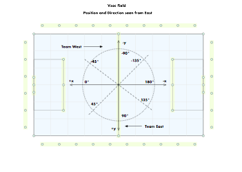
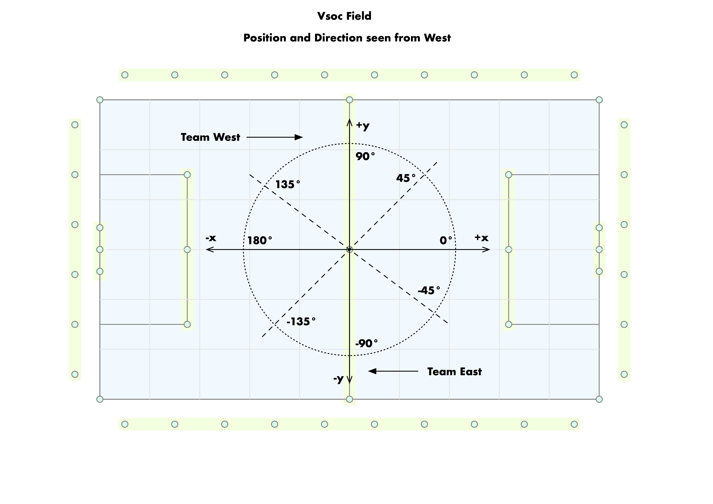
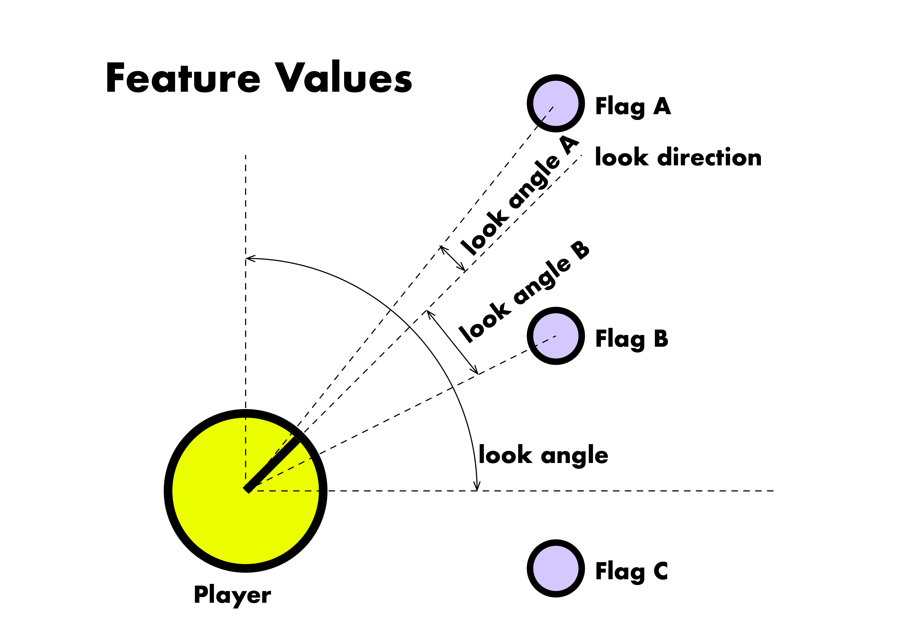
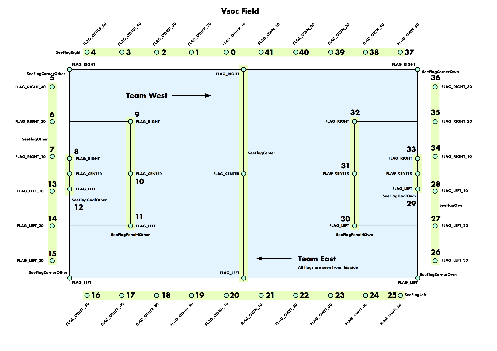
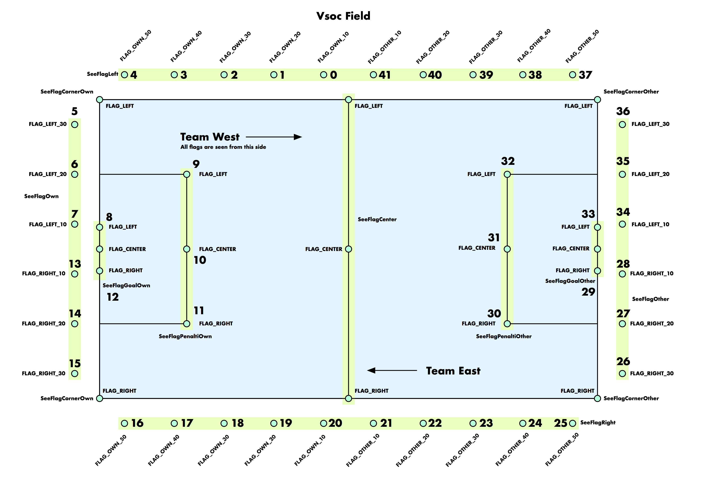

# Random-Pos-001

## Description

Contains Datasets that describe the relation of flags seen by a player to its position at the field and the direction it is currently looking at.

## Absolute Position and Absolute Direction
Position is relative to the Side the player is currently playing.

Value ranges:
* x: -50 to 50
* y: -30 to 30
* direction: -180 to 180

x, y values outside the range are possible but lay outside the field.

Position and direction seen from the east and west side.

](images/posdir_west_thumb.png)

## Features

The features contained in the dataset define weather a player sees a certain flag at his current position and the direction he is looking. There is one value for each of the 41 flags the player can see. The value is 0 if the player does not see the flag. If the value is greater than 0, the player can see the flag. The value is the angle + 100 in which the player sees the flag. 

The following image explains the feature values for one player and  three flags.

](images/FeatureValues_thumb.png)

* Flag A: The player sees the flag in an angle of +10° → The feature value is 100 + 10 = 110.
* Flag B: The player sees the flag in an angle of -25° → The feature value is 100 – 25 = 75.
* Flag C: The player does not see the flag → The feature value is 0.

Flags seen from east and west side

](images/flags_east_thumb.png)
](images/flags_west_thumb.png)

## Datacolumns

* 0: Rownumber
* 1: X-Position 
* 2: Y-Position 
* 3: Direction
* 4 - 45: Features for Flags 0 - 41

## Create your own data

Prerequisites

* Have [sbt](http://www.scala-sbt.org/download.html) installed on your comuter
* Have [git](https://git-scm.com/downloads) installed on your computer

Steps

* clone the vsoc repository. git clone https://github.com/wwagner4/vsoc.git
* change to the directory vsoc/machinelearning-2017/
* call 'sbt'
* change to module 'create_data' by typing 'project create_data'
* create new datasets in $HOME/vsoc/data by typing 'runMain playerpos.PlayerposCreateDataMain'

