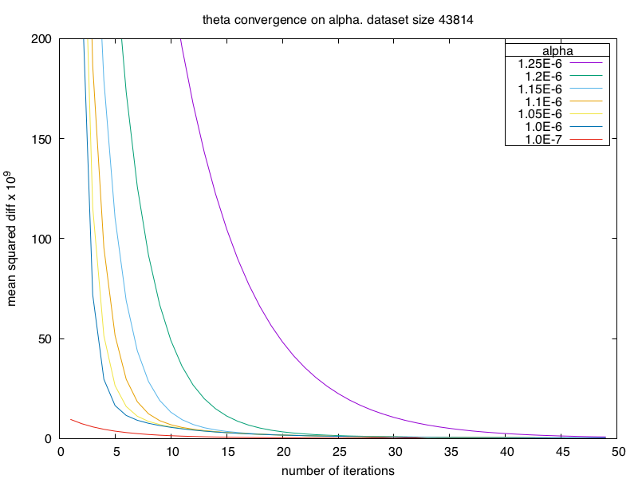
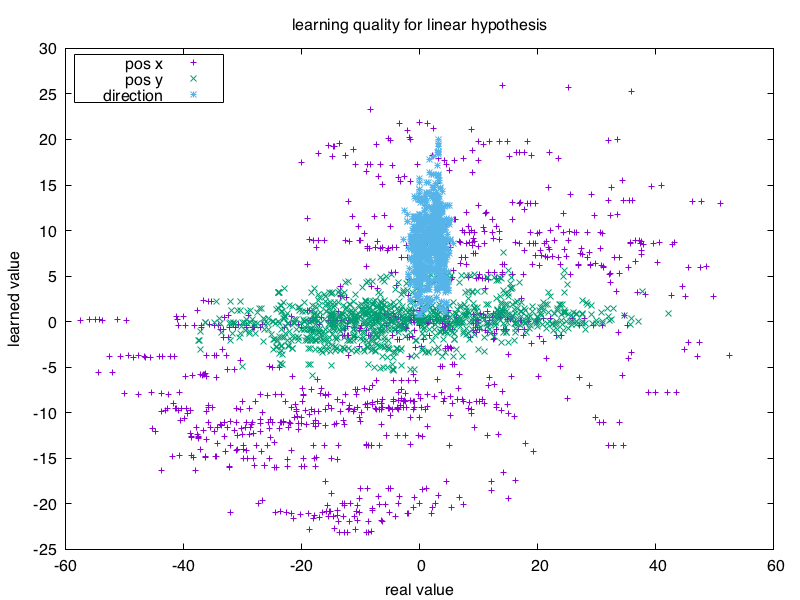
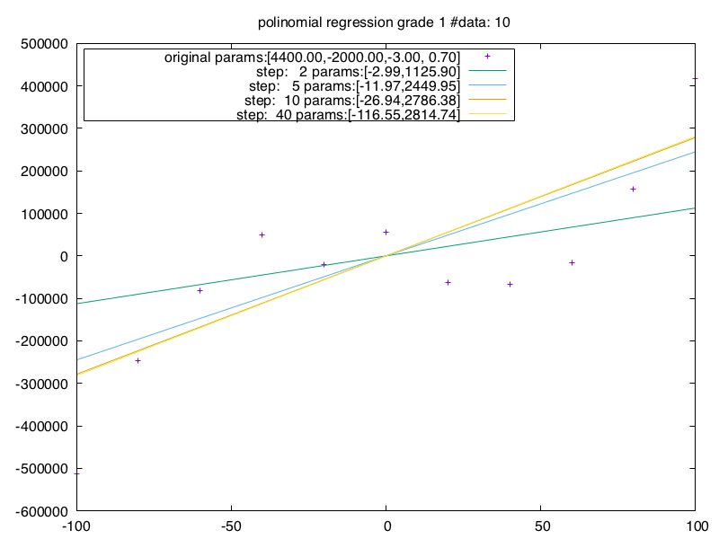
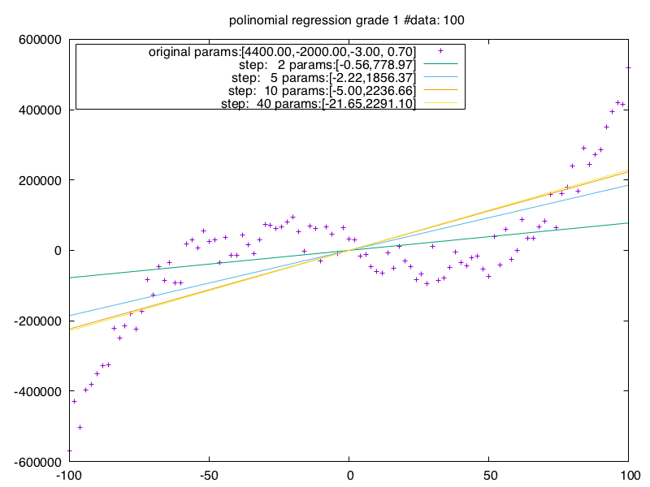
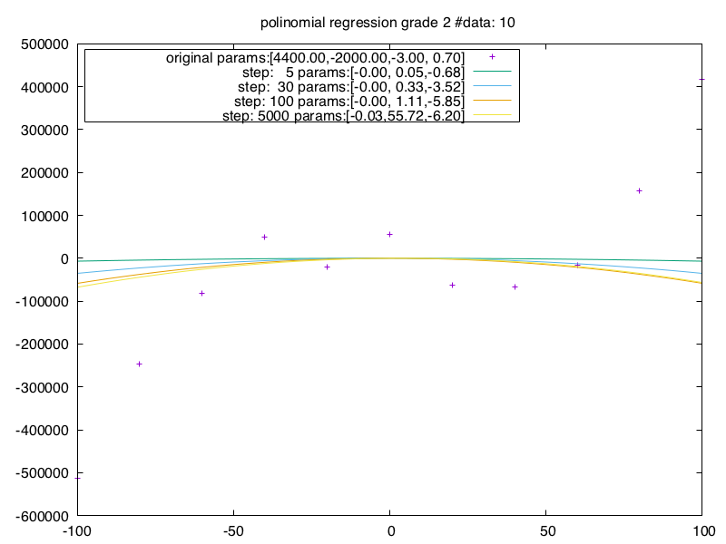
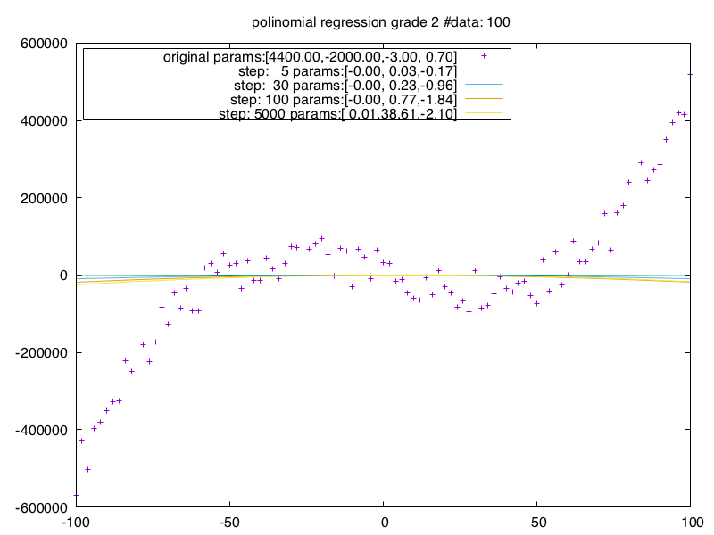
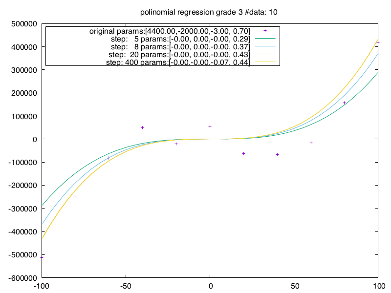
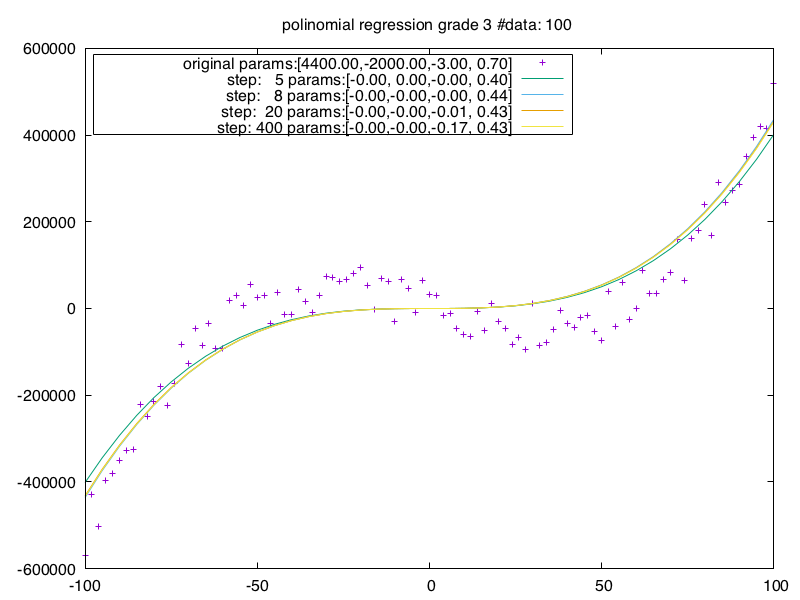

# Linear regression on the vsoc position dataset

Linear regression did not lead to any result. Only when selcting very small alpha values 
the paramethers (theta) converged. But using these parameters to predict 
the position of the playes did not work at all. 

# Linear regression on the polynomial dataset

The polinomial dataset is created by a polynomial function of the third grade
with the following parameters

 4400.0, -2000.0, -3, 0.7
 
The resulting values get a random offset. This offset is equally distributed in the interval [-60000, 60000]

Using polynomial regression leads to the following results

* Only polynomials of grade 1, 2 and three converge. 
* Polynomials 
* Alpha must be a very small value. 1.0E-10
* Findig appropriate alpha values is a pain in the ass

